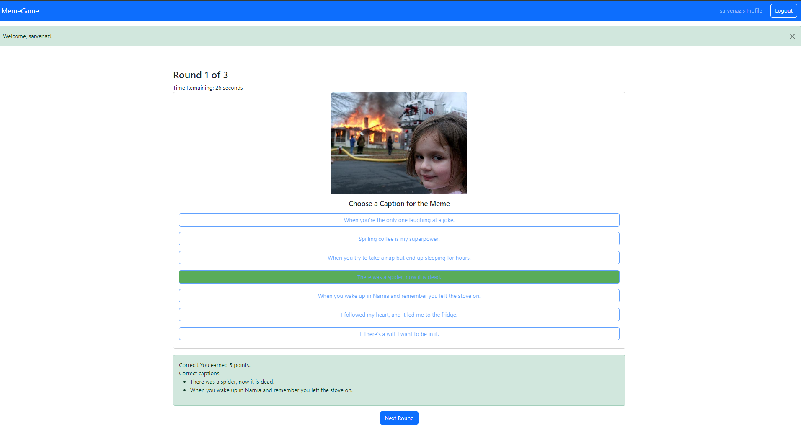
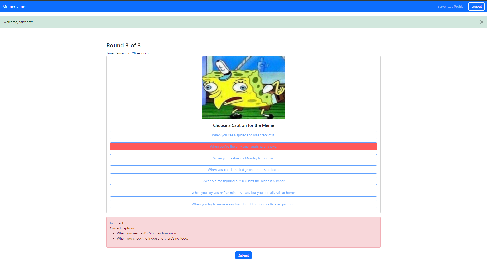

# Exam 1: "Meme Game"
## Student: s326344 ROUMIANFAR SARVNAZSADAT 

## React Client Application Routes

- Route `/`: The welcome page is the entry point of the application. It provides an introduction to the game and a button to start playing.

- Route `/login` : The login page allows users to log in to the application. It includes fields for entering a username and password and a button to submit the login form.

- Route `/game`: The game page is where the main gameplay occurs. Users are presented with a meme and several captions to choose from. Depending on the user's login status, they will play a different number of rounds. The page also includes a timer for each round.
  - Parameters:
        loggedIn: Boolean indicating if the user is logged in.
        user: Object containing user information.
        
- Route `/profile` :The profile page displays the logged-in user's profile information, including their game history and total score. It allows users to track their progress and review past game sessions.
  - Parameters:
      loggedIn: Boolean indicating if the user is logged in.
      user: Object containing user information.

## Main React Components

- `WelcomePage` (in `WelcomePage.jsx` ): The WelcomePage component serves as the introduction screen for the application.
  - Main Functionality
      - Displays a welcome message.
      - Provides a "Start" button that changes its label based on the user's login status (logged-in users - - see "Start", while guests see "Start as Guest").
      - The button triggers the game start process when clicked.
- `GamePage` (in `GamePage.jsx`): The GamePage component handles the main game functionality where users guess captions for memes.
  - Main Functionality
      - Manages game state, including the current round, meme, captions, score, and timer.
      - Fetches memes and captions from the API.
      - Allows users to select a caption and provides feedback on whether their choice was correct.
      - Tracks the user's score and advances to the next round or ends the game after the final round.
      - Submits game data to the API upon game completion.
- `ProfilePage` (in `ProfilePage.jsx`): The ProfilePage component displays the logged-in user's profile information, including their game history and total score.
  - Main Functionality
    - Fetches and displays the user's game history and total score from the API.
    - Displays a summary of each game, including individual round scores and total score of the game.
    - Shows the user's total score across all games.
- `Summary`  (in `Summary.jsx`): The Summary component provides a summary of the game's results after it has been completed.
  - Main Functionality
    - Displays the user's correct answers and the total score achieved in the game.
    - Provides a visual summary of the game performance, including details of each round.

(only _main_ components, minor ones may be skipped)

## API Server

- POST `/api/sessions`: Authenticates a user and starts a session.
  - Request Body: { username: string, password: string }
  - Response: { message: Login successful, user: { id: integer, username: string }}
  - response status codes:
      - 200: OK - Login successful.
      - 401: Unauthorized - Incorrect username or password.

- GET `/api/sessions/current`: Retrieves the current authenticated user's session.
  - Response: { id: integer, username: string }
  - Response Status Codes:
      - 200: OK - User is authenticated.
      - 401: Unauthorized - Not authenticated.

- DELETE  `/api/sessions/current`: Logs out the authenticated user and ends the session.
  - Request Body: None
  - Response: None
  - Response Status Codes:
      - 200: OK - Logout successful.

- GET `/api/memes`: Retrieves a random meme.
  - request parameters: None
  - Response: `{ "memeId": "integer", "imageUrl": "string" }`
  - response status codes:
      - 200: OK - Meme retrieved successfully.
      - 500: Internal Server Error - Server error while retrieving meme.

  

-  GET `/api/meme/captions`: Retrieves seven possible captions for a given meme .
  - request Parameters: memeId
  - Response: `{ captions: [{ id: integer, caption: string }, { id: integer, caption: string }] }`
      - 200: OK - Captions retrieved successfully.
      - 500: Internal Server Error - Server error while retrieving captions.

- GET `/api/userGameHistory/:userId`: Retrieves game history of a user.
  - request body: `userId `
  - Response: `{ "games": [{ "gameId": "integer", "rounds": [{ "round_id":"integer","selected_caption_-id":"integer", "score": "integer" ,"meme_url":"string"}] }] }`
  - response status code:
      - 200: OK - Profile and game history retrieved successfully.
      - 500: Internal Server Error - Server error while retrieving profile.

- POST  `/api/saveResults` : Saves game results.
  - request parameters: `{"user_id": "integer","round":"integer", "meme_id":integer","selected_caption_id:"integer", "score":"integer" }]} }`
  - Response:  `{"message": "Game results saved successfully"}`
  - Response Status Codes:
  - 200: OK - Game results saved successfully.
  - 500: Internal Server Error - Server error while saving game results.

## Database Tables

- Table `users` - Stores user details including a unique username and a hashed password.
  - ` id, username, password, salt `
- Table `memes` - Contains the meme images. Each meme is represented by its URL.
  - `id, url`
- Table `captions` - Stores the text for captions that can be associated with memes.
  - `id, caption`
- Table `meme_caption` -Associates memes with the two best matching captions.
  - ` meme_id, caption_id`
- Table `games` - Keeps track of individual game sessions played by users.
  - ` id, user_id`
- Table `rounds` - Details each round within a game, including the meme displayed, the caption selected by the player, and the score for that round.
  - `id, game_id, meme_id, selected_caption_id, score`
## Screenshots

## Users Credentials

- username, password of 2 users:
- 1

    - usename: sarvenaz
    - password: sarvenaz
    - hashed pass: c71416e7a96152cb505da1298807f1fffde71bc1353a51245f242f6761751d52
    - salt: 1a2b3c4d5e6f7g8h

- 2

    - username: newUser
    - password: newUser
    - hashed password: 2c2e55af556279a53708039aecc297464b272beedd3cd9973337b5df786ce1fa
    - salt: 9i0j1k2l3m4n5o6p